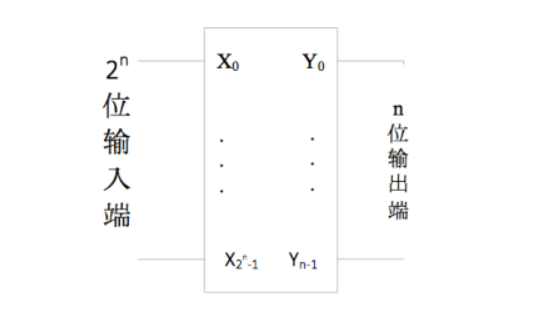

# 数字逻辑与计算机组成实验

- #### 实验名称: lab2 8-3 优先编码器


- #### 院系: 计算机科学与技术系


- #### 学生姓名: 徐简


- #### 学号: 202220013


- #### 班级: 数字逻辑与计算机组成实验1班


- #### 邮箱：161200063@smail.nju.edu.cn


- #### 实验时间: 2022 年 3 月 16 日


### 数字逻辑与计算机组成实验Lab2

##### 202220013 徐简 161200063@smail.nju.edu.cn


### 一, 实验目的

- 复习译码器和编码器的相关知识
- 设计一个8-3优先编码器


### 二, 实验原理

编码器是一种与译码器功能相反的逻辑电路，编码器的输出编码比其输入编码位数少。常用的二进制编码器把来自于 2n 条输入线的信息编码转换成 n 位二进制码。二进制编码器每次输入的 2n 位信号中只能有一位为 1，其余均为 0（即独热码），编码器的输出端为一个二进制数，用来指示对应的哪一个位输入为 1。

优先编码器允许同时在几个输入端有输入信号，即输入不止一个 “1”，编码器按输入信号排定的优先顺序，只对同时输入的几个信号中优先权最高的一个进行编码。



### 三, 实验环境/器材

- Quartus
- DE10-Standard开发平台 

- FPGA开发板


### 四, 程序代码/流程图

需要注意的是：Y的最低位表示有无输入，所以在case语句中实际上y的值是2*x+1。

```verilog
module encoder83(X, Y, Z);
	input [7:0] X;
	output reg [3:0] Y;
	output reg [6:0] Z;
	integer i;
	always @(X) begin
		begin : CODE
		Y[3:0] = 4'b0000;
		for (i = 7; i >= 0; i = i - 1)
			if (X[i] == 1) begin
				Y[3:1] = i;
				Y[0] = 1;
				disable CODE;
			end
		end
		case (Y)
			4'd1 : Z = 7'b1000000;
			4'd3 : Z = 7'b1111001;
			4'd5 : Z = 7'b0100100;
			4'd7 : Z = 7'b0110000;
			4'd9 : Z = 7'b0011001;
			4'd11 : Z = 7'b0010010;
			4'd13 : Z = 7'b0000010;
			4'd15 : Z = 7'b1111000;
			default : Z = 7'b0000000;
		endcase
	end
endmodule
```


### 五, 实验步骤/过程

- 使用DE10软件建立工程，这样可以自动进行引脚分配
- 编写8-3优先编码器代码，并在项目中实例化
- 进行测试
- 上板验证

### 六, 测试方法

- 仿真：如⑦中所示，依次将SW从低位到高位置1，观察HEX0以及LED的输出
- 上板测试：写入fpga开发板，根据功能测试输入输出的情况

### 七, 实验结果

软件仿真


FPGA上板


### 八, 遇到的问题和解决办法

- 在使用DE10自动分配引脚后，上板验证，多余的数码管一直会全亮，上图也可以看到

### 九, 实验得到的启示

- 同样功能的编码器和数码管有很多种使用方法，选择正确的verilog语句，可以节省很多时间
- 在使用Case的时候，注意Y的取值（题目要求有一位表示是否有输入)

### 十, 意见和建议

- 如果有使用DE10的相关示例教学就更好了
- 想知道怎么设置让多余的数码管不发光（除了在代码中将其置零orz）